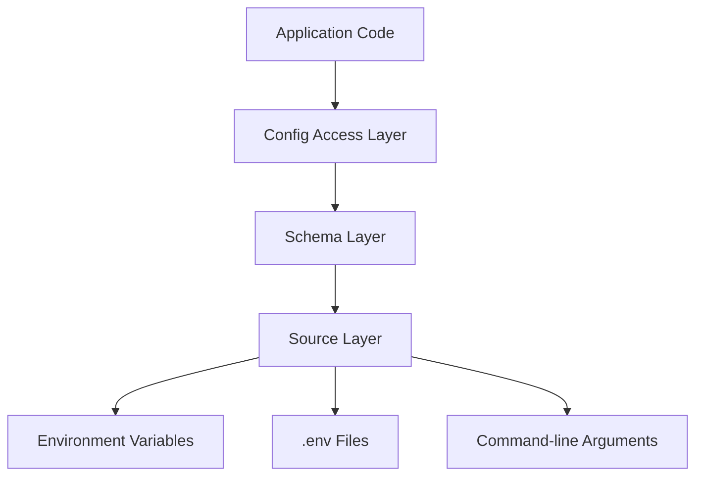

# Design Document: Configuration Management System

## Overview

This design document outlines a type-safe configuration management system for Python applications. The system will provide a centralized way to access configuration values with proper type safety, supporting multiple environments and configuration sources.

## Architecture

The configuration system will follow a layered architecture:

1. **Source Layer**: Handles loading raw configuration from various sources (files, environment variables, command-line arguments)
2. **Schema Layer**: Defines the structure and types of configuration values
3. **Access Layer**: Provides a unified interface for accessing typed configuration values



## Components and Interfaces

### ConfigSource

An abstract base class for configuration sources:

```python
class ConfigSource(ABC):
    @abstractmethod
    def get_raw(self, key: str) -> Optional[str]:
        """Get raw string value for a key"""
        pass
        
    @abstractmethod
    def reload(self) -> None:
        """Reload configuration from source"""
        pass
```

Implementations:
- `EnvFileSource`: Loads configuration from .env files
- `EnvVarSource`: Loads configuration from environment variables
- `CLIArgsSource`: Loads configuration from command-line arguments

### ConfigSchema

Base class for defining configuration schemas with typed fields:

```python
class ConfigSchema:
    """Base class for configuration schemas"""
    pass
```

Specific schema implementations:
- `AppConfig`: Application-specific configuration
- `DatabaseConfig`: Database connection configuration
- `LoggingConfig`: Logging configuration

### ConfigManager

Central configuration manager that provides access to typed configuration values:

```python
class ConfigManager:
    def __init__(self, sources: List[ConfigSource]) -> None:
        """Initialize with configuration sources"""
        pass
        
    def get_string(self, key: str, default: Optional[str] = None) -> str:
        """Get string configuration value"""
        pass
        
    def get_int(self, key: str, default: Optional[int] = None) -> int:
        """Get integer configuration value"""
        pass
        
    def get_float(self, key: str, default: Optional[float] = None) -> float:
        """Get float configuration value"""
        pass
        
    def get_bool(self, key: str, default: Optional[bool] = None) -> bool:
        """Get boolean configuration value"""
        pass
        
    def get_schema(self, schema_type: Type[T]) -> T:
        """Get configuration as a schema instance"""
        pass
        
    def reload(self) -> None:
        """Reload configuration from all sources"""
        pass
```

## Data Models

### Configuration Value Types

The system will support the following primitive types:
- `str`: String values
- `int`: Integer values
- `float`: Floating-point values
- `bool`: Boolean values (true/false)
- `List[T]`: Lists of values
- `Dict[str, T]`: Dictionaries with string keys

### Schema Models

Schema models will be defined using dataclasses or Pydantic models to ensure type safety:

```python
@dataclass
class DatabaseConfig:
    host: str
    port: int
    username: str
    password: str
    database: str
    ssl_enabled: bool = False
```

## Error Handling

The configuration system will handle the following error cases:

1. **Missing Configuration**: Return default values or raise specific exceptions
2. **Type Conversion Errors**: Provide clear error messages when type conversion fails
3. **Schema Validation Errors**: Report validation errors when loading schema objects

Error handling will follow these principles:
- Early detection of configuration errors
- Clear error messages that help identify the source of the problem
- Graceful fallbacks to default values when appropriate

## Testing Strategy

The configuration system will be tested at multiple levels:

1. **Unit Tests**:
   - Test individual components (sources, schema validation, type conversion)
   - Test error handling and edge cases

2. **Integration Tests**:
   - Test loading configuration from actual files
   - Test command-line argument parsing
   - Test environment variable handling

3. **End-to-End Tests**:
   - Test the complete configuration flow in a realistic application context